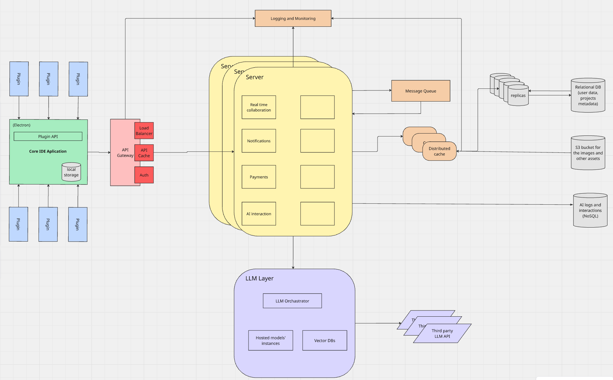

### Requirements

**Description:**
This is a Windsurf, cursor like IDE for AI code completion.

**Design assumptions:**

1. MAU: 1 000 000
2. DAU: 100 000
3. Data per user:

- usr settings and preferences: ~3MB
- AI interaction history and logs: ~35MB
- Project metadata and codebase indexes: ~70MB
- list of projects
- file trees, dependency graphs
- LSP indexes
- AI pre tokenization and caching
- local llm context storage
- Embedded Data for Code Intelligence: ~130MB
  **Total**: ~238MB on average
  more for daily active users,
  less for inactive users

Stored locally:

- setting/preferences
- project metadata/ indexes
- session history/cached edits

Stored on the Cloud:

- prompts/completions
- plugin list
- subscription state
- user accounts
- multiuser collaboration data
- monitoring data

**Use cases:**

1. Project creation and maintaining
2. Human AI interactions via chat

### High-level design

### Choice reasoning

**Architechture:**

Microkernel - for the core application

**Components:**

1. Core IDE Application
2. Plugins
3. API Gateway
4. Server
5. Logging
6. Monitoring
7. LLM Layer
8. Message queue
9. Distributed cache
10. Relational database
11. Blob storage
12. NoSQL database

_Reasoning:_

**Technological stack:**

Core IDE Application: Electron

1. Cross platform
2. Web technologies

**Project structure:**
