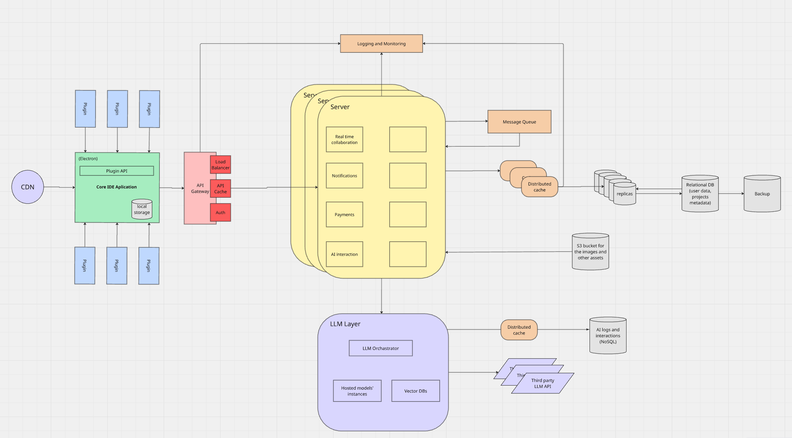

## Description

This is a Windsurf clone, cursor like IDE for AI code completion.

## Requirements

### **Design assumptions:**

1. MAU: 1 000 000
2. DAU: 100 000
3. Data per user:

- usr settings and preferences: ~3MB
- AI interaction history and logs: ~35MB
- Project metadata and codebase indexes: ~70MB
- list of projects
- file trees, dependency graphs
- LSP indexes
- AI pre tokenization and caching
- local llm context storage
- Embedded Data for Code Intelligence: ~130MB
  **Total**: ~238MB on average
  more for daily active users,
  less for inactive users

Stored locally:

- setting/preferences
- project metadata/ indexes
- session history/cached edits

Stored on the Cloud:

- prompts/completions
- plugin list
- subscription state
- user accounts
- multiuser collaboration data
- monitoring data

### **Use cases:**

1. Project creation and maintaining
2. Human AI interactions via chat

## High-level design

### **Choice reasoning:**

**Architechture:**

Microkernel - for the core application

_Reasoning:_

### **Technological stack:**

| Component              | Technology                                        | Reasoning                                                                                                                                                                                                                |
| ---------------------- | ------------------------------------------------- | ------------------------------------------------------------------------------------------------------------------------------------------------------------------------------------------------------------------------ |
| `Core IDE Application` | Electron                                          | 1. Cross platform  2. Web technologies                                                                                                                                                                                |
| `Plugins`              |                                                   |                                                                                                                                                                                                                          |
| `API Gateway`          |                                                   |                                                                                                                                                                                                                          |
| `Server`               | NodeJS - Server component   Python - LLM Layer | NodeJS has native WebSockets support. Good for concurrent connections. Will be easier to integrate with a client app as it is based on JS as well.   LLM Layer uses Python because of the best ecosystem for LLMs     |
| `Logging`              |                                                   |
| `Monitoring`           |                                                   |
| `LLM Layer`            |                                                   |
| `Message queue`        |                                                   |
| `Distributed cache`    | Redis                                             | 1. Platform independent   2. Rich data structure support   3. Commercial use support   4. Open source 5. Advanced queuing capabilities                                                                          |
| `Relational database`  | PostgreSQL                                        | 1. Twice cheaper than Oracle or 1,5x cheaper than SQL Server   2. No vendor lock-in   3. Good third party vendor support   4. Open source and platform independent   5. Many people who have expertise in it |
| `Blob storage`         | AWS S3                                            |
| `NoSQL database`       | MongoDB                                           |

### **Project structure:**
