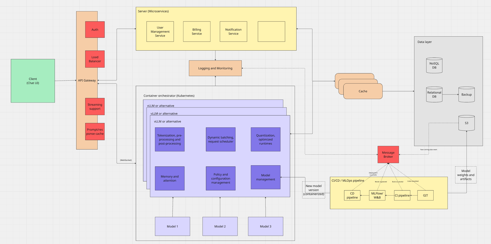

## Description

GPT like inference system

## Requirements

**Design assumptions:**

- Millions of users (>100 000 000)
- Very distributed usage
- High volume of data
- Low latency required
- Very high compute needed
- 1000 tokens x 3500 GFLOPs = 3.5 TFLOPs per request
- 100M x 3.5 TFLOPs = 3.5 x pow(10,20) FLOPs/day Total: ~350 exaFLOPs/day
- High energy consumption

### **Use cases:**

1. Human AI interactions via chat
2. Model updates and deployments

## High-level design

### **Choice reasoning:**

**Architechture:**

Event-driven: MLOps and CI/CD layer
Microservices: Server layer

_Reasoning:_

### **Technological stack:**

### **Project structure:**