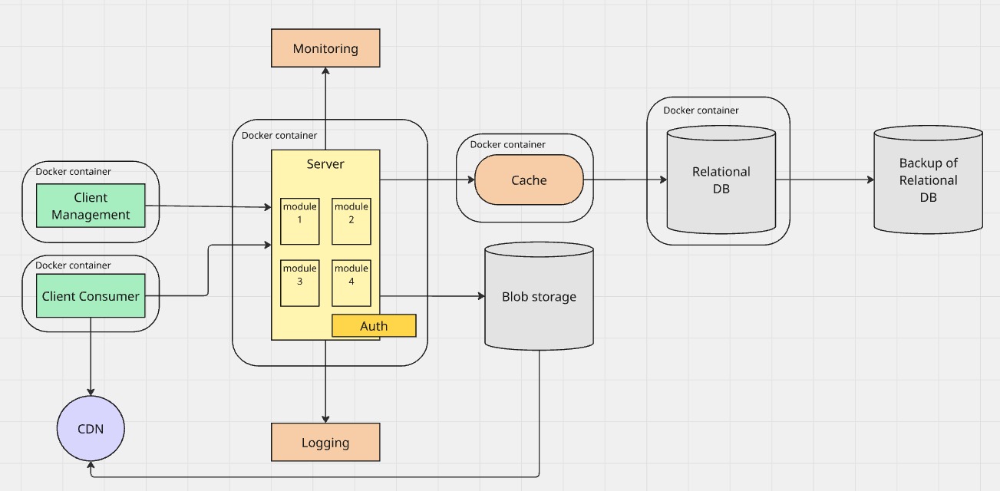

## Description

A small digital app library that is supposed to be used by a library to mek its books more accessible to the users in different formats.

## Requirements

**Design assumptions:**

- The library has a limited number of pdf books (less than 2000)
- Monthly active users: 1000
- Daily active users: 100
- Scale is possible in the future to support other small libraries
- One pdf size ~ 7MB
- One cover image size ~ 1MB
- One book metadata size ~ 2KB

### **Use cases:**

Admin:

1. Library admin can upload pdf books
2. Library admin can delete pdf books
3. Library admin can update pdf books
4. Library admin can view all pdf books

User:

1. User can view all pdf books
2. User can view a specific pdf book details
3. User can download a pdf book
4. User can search for a pdf book
5. User can filter pdf books by author, format, language, category
6. User can follow youtube or other links to check other book formats

## High-level design

## Choice reasoning

### **Architechture:**

Modular Monolith

_Reasoning:_

1. The application is small enough to be a monolith.
2. The modular monolith has a clear separation of concerns that can be scaled to microservices in the future.
3. Fast for MVP development.

### **Technological stack:**

| Component                     | Technology                               | Reasoning                                                                                                                                                                                                                                                                                                                                                                             |
| ----------------------------- | ---------------------------------------- | ------------------------------------------------------------------------------------------------------------------------------------------------------------------------------------------------------------------------------------------------------------------------------------------------------------------------------------------------------------------------------------- |
| `Client Consumer(frontend)`   | Can be any (React, Angular, Vue, Svelte) | Better to choose the one you(or your team) are good at. Svelte results in smaller bundles, but is still quite new.                                                                                                                                                                                                                                                                    |
| `Client Management(frontend)` | Can be any (React, Angular, Vue, Svelte) | Better to choose the one you(or your team) are good at. Svelte results in smaller bundles, but is still quite new.                                                                                                                                                                                                                                                                    |
| `Server`                      | NodeJS                                   | 1. Creates Full-stack JS application   2. Typescript (if used) is type-safe   3. Can share some code and data schemas with frontend 4. The app is not really big, so choosing Python or Go is also possible, the only concern here is using high intense CPU-bound tasks, but lickely this is not the case here and can be resolved by using message queue or background worker |
| `Logging`                     |                                          |                                                                                                                                                                                                                                                                                                                                                                                       |
| `Monitoring`                  |                                          |                                                                                                                                                                                                                                                                                                                                                                                       |
| `Relational database`         | MySQL                                    | 1. Web optimized   2. Easy setup   3. Cheap   4. Cross platform   5. No vendor lock-in                                                                                                                                                                                                                                                                                    |
| `Cache`                       |                                          |                                                                                                                                                                                                                                                                                                                                                                                       |
| `Blob storage`                |                                          |                                                                                                                                                                                                                                                                                                                                                                                       |

### **Project structure:**
